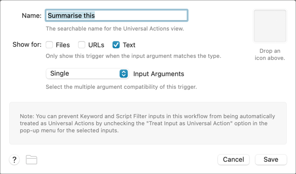
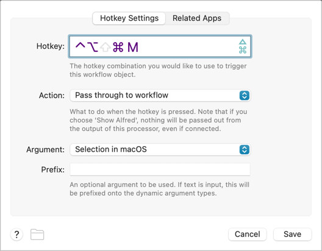
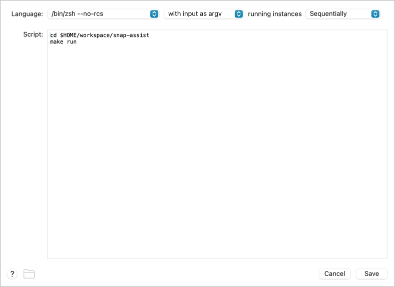

# SnapAssist

Summon intelligence in a snap


- **Github repository**: <https://github.com/namuan/snap-assist/>

## Getting started with your project

### 1. Create a New Repository

First, create a repository on GitHub with the same name as this project, and then run the following commands:

```bash
git init -b main
git add .
git commit -m "init commit"
git remote add origin git@github.com:namuan/snap-assist.git
git push -u origin main
```

### 2. Set Up Your Development Environment

Then, install the environment and the pre-commit hooks with

```bash
make install
```

This will also generate your `uv.lock` file

### 3. Run the pre-commit hooks

Initially, the CI/CD pipeline might be failing due to formatting issues. To resolve those run:

```bash
uv run pre-commit run -a
```

### 4. Commit the changes

Lastly, commit the changes made by the two steps above to your repository.

```bash
git add .
git commit -m 'Fix formatting issues'
git push origin main
```

You are now ready to start development on your project!

### 5. Alfred Integration







